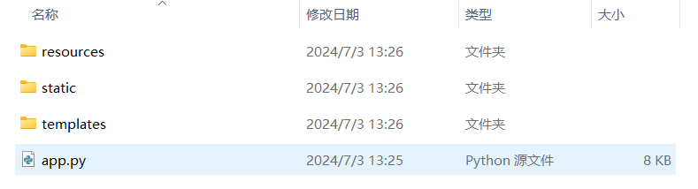
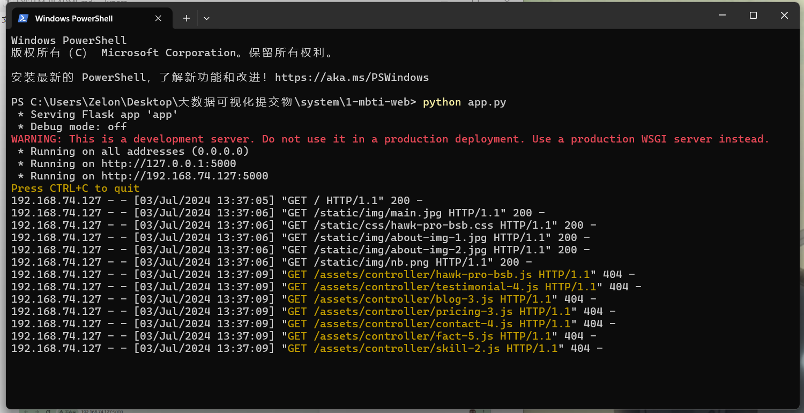
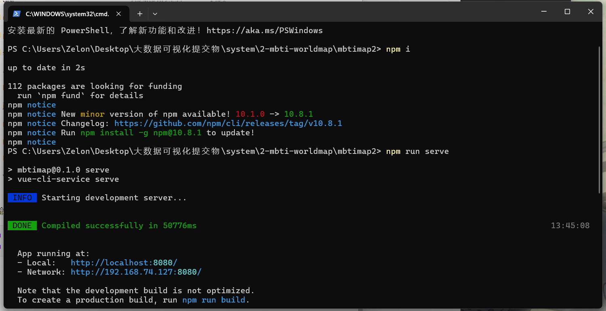
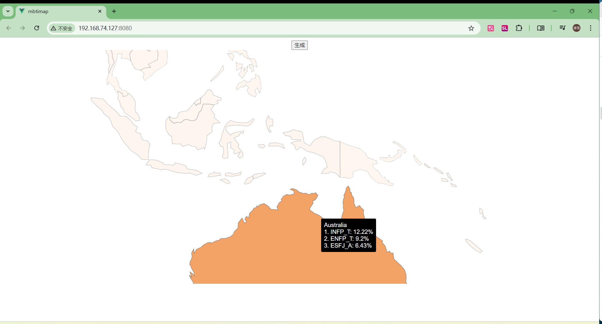
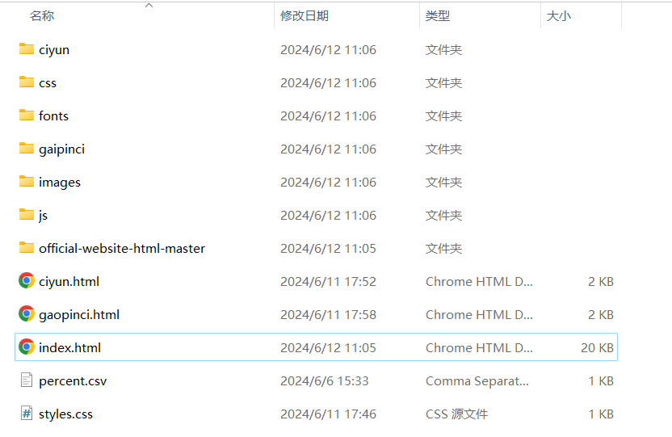
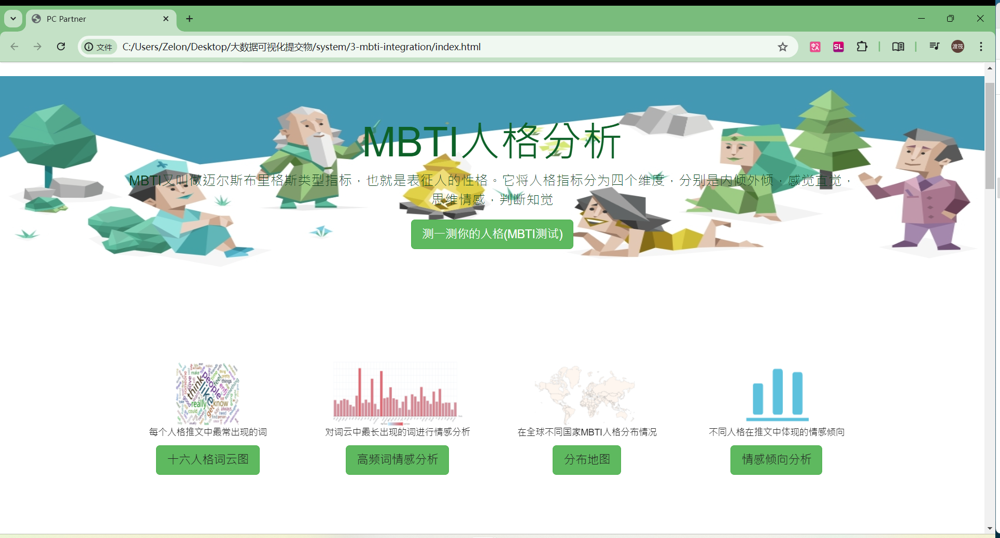

# SYSTEM-README

## 1. 文件夹清单

| 文件夹名           | 内容                         | 作者                   |
| ------------------ | ---------------------------- | ---------------------- |
| 1-mbti-web         | mbti可视化图表网页架构       | 袁泽龙                 |
| 2-mbti-worldmap    | mbti世界地图系统             | 宋毓佳、胡宇航         |
| 3-mbti-integration | mbti各维度可视化图表集成系统 | 夏诗航、李旭东、牛煜雯 |

## 2. mbti-web 使用指南

该文件夹为最终上台展示所用的网页版本，使用`flask`框架搭建，作者为袁泽龙。

如果需要本地部署，在文件夹中运行



```shell
python app.py
```

可以看到系统成功运行



点击网页可打开，看到演示网页


在展现过程中，我们同时也将该网页部署到了服务器上供大家访问，是利用`nginx`进行的反向代理

## 3. mbti-worldmap 使用指南

该文件为`mbti`的世界地图系统，需要进入到`mbtimap2`文件夹后


运行命令

```shell
npm i 
npm run serve
```

可以看到系统成功运行



点击可以打开网页，看到运行的地图



## 4. mbti-integration

该文件是第一版的集成文件，点击`index.html`即可打开



以下是成果


